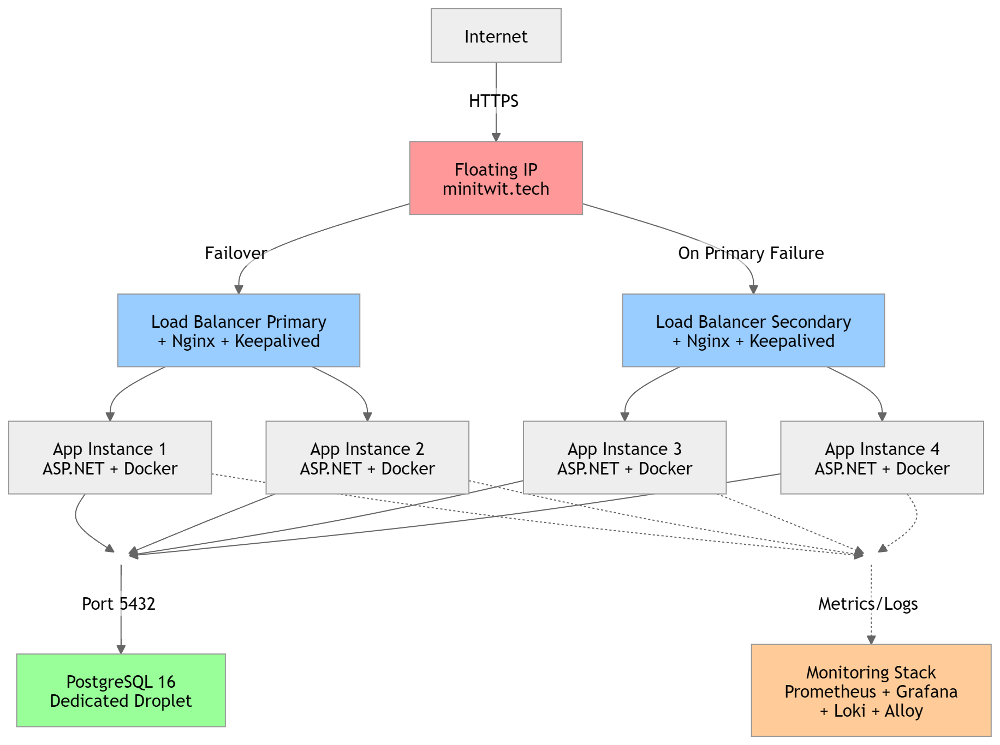

# Group B: Carls Alarm
**DevOps, Software Evolution and Software Maintenance** *IT University of Copenhagen*

| Name | Email |
| :--- | :--- |
| Bror Yang Nan Hansen | `broh@itu.dk` |
| Carl Andersen Stilvén| `csti@itu.dk` |
| Carl Frederik Thomsen| `cfth@itu.dk` |
| Konrad Meno Adolph| `koad@itu.dk` |
| Mikkel Clausen| `mikcl@itu.dk` |

---

## Table of Contents
- [Group B: Carls Alarm](#group-b-carls-alarm)
  - [Table of Contents](#table-of-contents)
  - [1 System's Perspective](#1-systems-perspective)
    - [1.1 Design and Architecture - csti](#11-design-and-architecture---csti)
    - [1.2 Dependencies](#12-dependencies)
    - [1.3 Current State of System](#13-current-state-of-system)
  - [2 Process' Perspective - koad and mikcl](#2-process-perspective---koad-and-mikcl)
  - [3 Reflection Perspective - broh](#3-reflection-perspective---broh)
    - [3.1 Group Coordination and Task Management (Evolution \& Refactoring)](#31-group-coordination-and-task-management-evolution--refactoring)
    - [3.2 Database Migration and Syntax Clashes (Operation)](#32-database-migration-and-syntax-clashes-operation)
    - [3.3 Trivy Vulnerability Scans and Exception Management (Maintenance \& CI/CD)](#33-trivy-vulnerability-scans-and-exception-management-maintenance--cicd)
    - [3.4 Reflecting on the DevOps style of work](#34-reflecting-on-the-devops-style-of-work)
  - [4 Use of Generative AI - broh](#4-use-of-generative-ai---broh)

---

## 1 System's Perspective

### 1.1 Design and Architecture - csti

The ITU-MiniTwit application is written in **C#** using **ASP.NET Core 9.0** with **Entity Framework Core 8.0**, deployed on **DigitalOcean** infrastructure with a **PostgreSQL 16** database backend.

The system implements an **Onion Architecture** pattern (as this project is built on top of the Chirp application from BDSA), organizing the codebase into the following layers:
- **Domain Layer**: Core business logic and entities
- **Repository Layer**: Data access abstraction  
- **Service Layer**: Business logic orchestration
- **Web Layer**: ASP.NET Razor Pages UI and API endpoints

The production environment is designed for high availability and fault tolerance. External traffic is directed to a DigitalOcean Floating IP, managed via Terraform. This IP routes to an active-passive load balancing tier consisting of two droplets running Nginx and Keepalived. Keepalived monitors the health of the primary Nginx instance via custom TCP probes, in the event of a failure, it automatically reassigns the Floating IP to the secondary load balancer. Nginx handles reverse proxying and TLS termination using Let's Encrypt certificates managed by an ACME companion container.

The active load balancer distributes incoming HTTP traffic across four containerized application instances. These application containers are set up using Ansible and deployed through GitHub Actions. They maintain a connection pool to a dedicated PostgreSQL database droplet. To enforce network security, the database droplet utilizes a restricted firewall that only allows inbound connections from the known application server IPs via `pg_hba.conf`.

The architecture also includes systems for monitoring and logging. Prometheus scrapes metrics from the application instances and Node Exporters every 15 seconds, while Grafana Alloy collects and ships Docker container logs to Loki. Grafana is utilized to visualize this telemetry data. For local development and testing, a Docker Compose stack runs the entire system on a developer machine.

<figure>
  
  <figcaption><b>Figur 1:</b> Summary of the load balancing architecture with active-passive failover via Nginx, Keepalived and DigitalOcean Floating IP - Made by cfth</figcaption>
</figure>

### 1.2 Dependencies

The system operates on multiple levels of abstraction, each introducing dependencies:

| **Layer** | **Technologies** | **Purpose** |
|-----------|------------------|-----------|
| **Application** | C# 9.0, ASP.NET Core 9.0, EF Core 8.0 | Web framework and ORM |
| **Database** | PostgreSQL 16, Npgsql library (v7.0+) | Relational data storage with async drivers |
| **Frontend** | Razor Pages, Bootstrap 5, JavaScript | Web UI and client-side interactivity |
| **Testing** | xUnit 2.4, Playwright 1.40+, Moq 5.0 | Unit, integration, and E2E test frameworks |
| **Containerization** | Docker, Docker Compose, Chiseled base images | Container runtime |
| **Infrastructure** | Terraform 1.5+, DigitalOcean | IaC and cloud provisioning |
| **Configuration Mgmt** | Ansible 2.10+, Jinja2 templates | Server provisioning and state management |
| **HA/LB** | Nginx 1.18+, Keepalived 2.2.4 | Reverse proxy, TLS termination, failover |
| **SSL/TLS** | Let's Encrypt, certbot, nginx-proxy, ACME | Certificate provisioning and renewal |
| **Monitoring** | Prometheus 2.50+, Grafana 11.0+, Node Exporter | Metrics collection and visualization |
| **Logging** | Grafana Loki 3.5.0, Grafana Alloy 1.0+ | Log aggregation and shipping |
| **CI/CD** | GitHub Actions, Docker Hub | Build automation and image publishing |
| **Code Quality** | SonarQube, Codacy, Semgrep, hadolint, dotnet format, Trivy | Static analysis and vulnerability scanning |

### 1.3 Current State of System

The deployment process is fully automated, allowing for frequent releases with specific tagging. Our PostgreSQL 16 database runs efficiently with active connection pooling and automated weekly DigitalOcean snapshots. However, the system relies on a single dedicated droplet for data storage, introducing a single point of failure into an otherwise load-balanced setup.

Our CI/CD setup blocks deployments if high-severity vulnerabilities are found. Currently, we have zero fixable issues in Semgrep or Trivy. We are tracking 25 vulnerabilities in our `.trivyignore` file, but these are all tied to transitive dependencies, where we are already running the newest available versions, meaning no patch currently exists. Additionally, while the system passes our test suite (over 85 unit tests, 20 integration tests, and 10 Playwright E2E tests), we recognize this does not cover every edge case and leaves some blind spots in our application logic.

While the infrastructure is stable, static analysis reports from SonarQube and Codacy show that we have a lot of technical debt. Our SonarQube quality gate is currently failing, primarily due to 11 open security issues, 16 security hotspots, and 766 maintainability issues largely flagged as code "pitfalls" and design convention violations. Similarly, Codacy highlights 24 open issues across the repository. A significant portion of these stem from hardcoded passwords left in our end-to-end test files and Ansible playbooks, C# async methods returning void instead of Tasks, and third-party GitHub Actions in our workflows that are not securely pinned to full commit SHAs. Addressing these static analysis warnings represents the next major step for improving the project.

---

## 2 Process' Perspective - koad and mikcl

### 2.1 CI/CD Pipeline
The CI/CD pipeline begins when code is pushed through a pull request. In GitHub Actions, the repository is checked out, .NET is configured, and code quality checks are run with dotnet format and hadolint. Semgrep is also executed to detect common security issues early. After these checks, the project is built with dotnet build, Playwright is installed for end-to-end testing, and xUnit is used for both unit and integration tests. If any step fails, deployment is stopped. When everything passes, Docker images for Prometheus and Grafana are built, scanned with Trivy, and pushed to Docker Hub with a version tag. Finally, GitHub Actions connects to the production server over SSH, pulls the new image, and restarts the container so the updated version goes live.

### 2.2 Ansible Deployment
The Ansible playbook starts by preparing the database server with PostgreSQL; already installed packages are not reinstalled. It also restricts database access to application nodes and creates the MiniTwit database and user. Next, it prepares the web and monitoring hosts by installing Docker, creating shared networks and volumes, and deploying the application alongside Prometheus, Loki, Alloy, Grafana, and the reverse proxy. For high availability, the playbook configures keepalived and failover scripts so the floating IP can move automatically if a node fails.

### 2.3 Monitoring and Logging
Prometheus and Grafana are used to monitor the system. Prometheus scrapes metrics from the application, database, and host machines, while Grafana visualizes the data in dashboards. The main focus is application performance, including request latency, request counts, error rates, database connection usage, CPU, memory, disk, and network usage. Logging focuses on requests, errors, authentication events, and database-related messages. This makes troubleshooting easier without manual server inspection. Logs are collected centrally with Grafana Alloy and forwarded to Loki, where they can be searched and filtered in Grafana to trace failures and follow specific requests.

### 2.4 Security
We hardened security in both CI/CD and production. In CI/CD we use Semgrep and Trivy to catch insecure code and vulnerable images before deployment. In production Ansible restricts PostgreSQL access to known app nodes, it also removes broad access rules and protects secrets with strict permissions. Further we run containers with reduced privileges and safer defaults to limit the impact of potential attacks.

### 2.5 Availability and Scaling
We handle availability by running multiple MiniTwit containers behind a reverse proxy and using keepalived with a floating IP for failover between load balancer nodes. We handle scaling horizontally by changing the number of application instances in Ansible, which recreates containers one by one to reduce downtime. Monitoring with Prometheus and Grafana allows us to detect issues early and react before users are affected.

---

## 3 Reflection Perspective - broh
### 3.1 Group Coordination and Task Management (Evolution & Refactoring)
During the refactoring phases of the system, the primary challenge was falling behind. The structure of the tasks were often interdependent on each other making it hard to delegate tasks out in a way where pair programming could be taken advantage of. An attempt at mob programming with a rotating driver and navigator was made in the beginning but was unsuccessful, as some people would lose focus just listening. Our solution was to limit active development to a maximum of 2-3 team members concurrently while the remaining members would focus on asynchronous tasks like doing the exercises to understand the eventual pull request they would review later. 

### 3.2 Database Migration and Syntax Clashes (Operation)
The primary technical challenge was migrating our database from SQLite to PostgreSQL while trying to achieve as little downtime in our system as possible. To achieve this, a tool called `pgloader` was used which makes it possible to load data from a SQLite database directly into a postgres database. Initially the migration went very well. A new DigitalOcean droplet and a clean postgres database was created. `pgloader` commands were then used to migrate the data itself and it all worked out. That was until a couple of days later when the status overview dashboard graphs displayed a sudden surge in failed message requests as well as user registration requests. The culprit was the different type safety the two databases use.

SQLite uses very loose and forgiving data types, whereas PostgreSQL is very strict. This results in mismatches in the database where PostgreSQL expects a certain type which wasn't translated by pgloader. A good example is the Cheep.Timestamp: 

`public required DateTime TimeStamp { get; set; }`

In the SQLite database the timestamps were stored as Unix integers, and when pgloader migrated the data to PostgreSQL, it kept it as an integer column. However the Entity Framework Core looks at the Cheep model and sees a strict `DateTime` type. 

Another example is SQL Dialect Clashes. For new data insertions, our EF Core configuration was hardcoded to use `.HasDefaultValueSql("datetime('now')")`. While valid in SQLite, PostgreSQL does not recognize this specific function, causing all new `INSERT` operations (registrations and messages) to instantly crash at the database level.

The solution to these issues was creating AI-assisted SQL `ALTER` scripts to correct the type mismatches, successfully casting the integers to proper PostgreSQL timestamps. And for the second issue the solution can be seen here: [Pull Request #34](https://github.com/DevOps-Group-B/MiniTwit/pull/34).

### 3.3 Trivy Vulnerability Scans and Exception Management (Maintenance & CI/CD)
Another major issue were false positives. Trivy works by scanning all dependencies that are used in the project. If any of the libraries used have been found to have a vulnerability the CI/CD pipeline will fail. Even when updating the dependencies to a newer version that Trivy suggested, the issue reoccurred. The problem was realizing that Trivy stops the pipeline due to *transitive* dependency vulnerabilities existing deeper within third-party libraries that are used by the direct dependencies we used.

In some cases, no matter what version we updated our dependencies to, it would still be flagged, essentially resulting in a false positive. The solution to this was to make a `.trivyignore` file that would ignore the vulnerabilities that other libraries have in order for the CI/CD pipeline to continue.
 
 
We learned this was an issue that we could not do anything about due to complex library dependency chains. Something we have no control over. Pull Request [#75](https://github.com/DevOps-Group-B/MiniTwit/pull/75), [#76](https://github.com/DevOps-Group-B/MiniTwit/pull/76), [#82](https://github.com/DevOps-Group-B/MiniTwit/pull/82), [#88](https://github.com/DevOps-Group-B/MiniTwit/pull/88), and [#130](https://github.com/DevOps-Group-B/MiniTwit/pull/130) are examples of vulnerabilities being added to the `.trivyignore` list.

### 3.4 Reflecting on the DevOps style of work
**Technical Reflection**
In previous projects, the workflow was highly traditional. Groups would use feature branch Git workflows where they write code locally and push it to a shared repository. Live deployments were rarely needed, but the classical issue of "why doesn't it work on my machine" would often occur. The DevOps style of work has taught us the methods to avoid these issues like relying on containerization of apps using `Docker`. Getting better at using `Github Actions` for continuous integration and deployment(CI/CD) has also been a huge help when working with these bigger DevOps projects. Once the pipeline was established, code would be tested and deployed automatically, drastically reducing manual overhead. Learning about code linters, Static Code Analysis and SonarQube has also been very helpful to avoid smaller unnoticeable mistakes and in general writing better code.
Learning `Vagrant`, and later refactor to use `Terraform` for Infrastructure as Code(IaC) has also been important to ensure our system and architecture is easily reproducible, scalable and free from manual configuration drift.

Lastly working with real servers has been very fun. Using DigitalOcean as our server provider has been very easy and efficient. The next step to full ownership and more privacy is to deploy on a private server like a raspberry pi or an old laptop.

While our DevOps tech and implementation was successful our team dynamic was a bit of a mess. The idea of DevOps is to share the responsibility, but the way the tasks was set up incentivized us to limit the number of people working at a time in order to effectively refactor the architecture in time. The big takeaway here is that doing DevOps right takes a real commitment to cross-training and pair programming. Next time around, we need to make sure everyone gets to learn and deploy and refactor the system rather than a few experts doing most of the work. 

---
## 4 Use of Generative AI - broh
The biggest uses of LLM models was for the migration of data, setting up High Availability setups as well as different architectures regarding IaC. We used Gemini 3.0 Pro chat to help use genereate the SQL scripts to manually go on the database server to correct the type missmatchs. It was very succesful. Secondly we also used LLMs when migrating from Vagrant to Terraform. We use Github Copilot with the "auto" model selected. This made it possible for the model to use agents, making it able to see the whole codebase and look into files for missing information. This was however a frustrating experience as the agent created large changes that we had a hard time understanding. It also just didn't work most of the time. Some examples can be seen here: This was the same experience when setting up the High Availability setups. 

Commit [16bcff9](https://github.com/DevOps-Group-B/MiniTwit/commit/16bcff94dc48f949be449ff45df60305c4f148b4)

Commit [b41b77b](https://github.com/DevOps-Group-B/MiniTwit/commit/b41b77b21f87933ad9425dac3446fd018f3bb358)

Commit [16ad2ac](https://github.com/DevOps-Group-B/MiniTwit/commit/16ad2acd1c119d9a7f7fc3aa6839a56d29a438b4)
